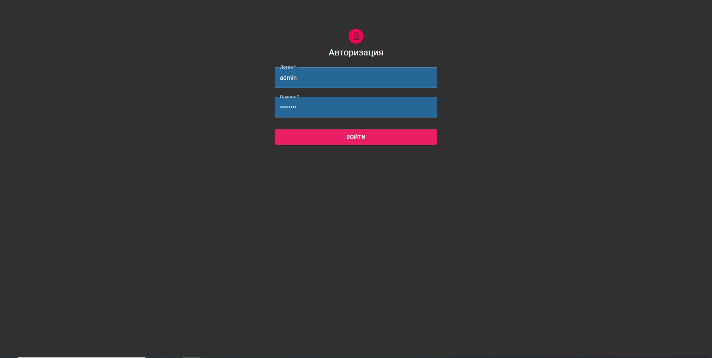
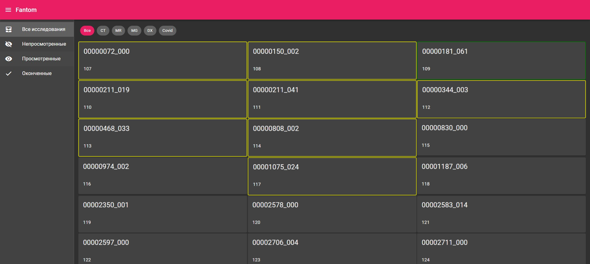
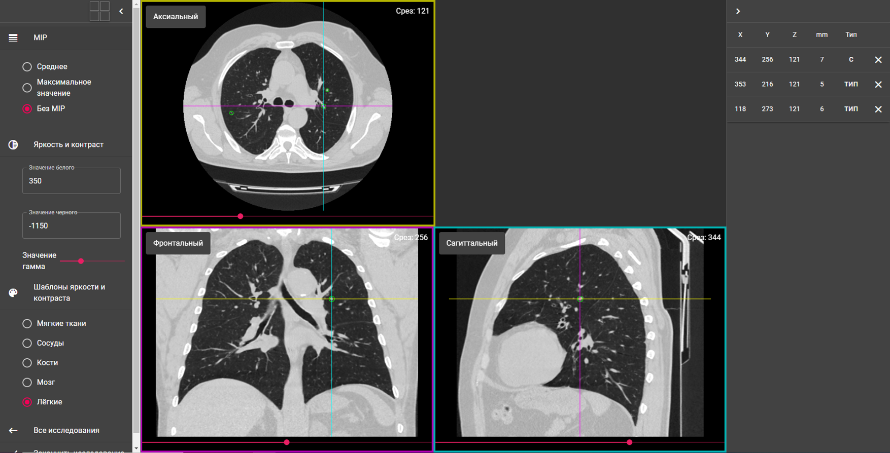

# FAnTom-web

### FAnTom-web is a software for creating datasets of marked CT-images for machine learning systems.

## Modules

* FAnTom-web consists of several modules:
  * [Api Models Library](api-models) &mdash; MPP library with constants and serializable data classes for client-server interaction
  * [Backend Models Library](api-models) &mdash; Java library with constants and serializable data classes for server-side logic
  * [Main Backend Server](main-server) &mdash; Main Server with MySQL. Depends on [Api Models Library](api-models), [Backend Models Library](api-models).
  * [KotlinJs React](frontend) &mdash; Frontend Js app built on KotlinJs. Depends on [Api Models Library](api-models).

## Configuration

- Add all needed data (passwords, DB config etc.) in [application.conf](main-server/src/main/resources/application.conf)

## Run application

- `./gradlew :main-server:run` will run development [Main Backend Server](main-server)
- `./gradlew :frontend:js:run` will build optimized [KotlinJs React](frontend) bundle and run it on https://localhost:8080
- `./gradlew :frontend:js:run -t` will run development [KotlinJs React](frontend) at https://localhost:8080 with live reload
    
## Distribution

- `./gradlew :main-server:build` will create `main-server/build/libs/main-server.jar`. You can deploy it on the server and run `java -jar main-server.jar` to start the server. Client is included.
- `./gradlew :frontend:js:build` will create `frontend/js/build/distributions/js.js` and `frontend/js/build/distributions/index.html`.

## Description

It is a [Kotlin Multiplatform](https://kotlinlang.org/docs/reference/multiplatform.html) project.

It uses:
- [FAnTom](https://github.com/Center-of-Diagnostics-and-Telemedicine/FAnTom) web-service for DICOM processing.
- `kotlin-multiplatform`, `kotlin-js` and `kotlin-jvm` plugins for Kotlin compilation;
- [Ktor framework](https://ktor.io) as a web server;
- [Exposed](https://github.com/JetBrains/Exposed) and MySQL;
- [kotlinx.serialization](https://github.com/Kotlin/kotlinx.serialization) for client/server (de-)serialization;
- [MVIKotlin](https://github.com/arkivanov/MVIKotlin) for client-side architecture;
- [React](https://reactjs.org), [Styled components](https://www.styled-components.com) and [kotlin-wrappers](https://github.com/JetBrains/kotlin-wrappers) for rendering.

## Screenshots

* Auth

* List Screen

* Main Screen

## License

General license information is located in the LICENSE file.
